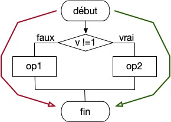

# Complexité cyclomatique

La complexité cyclomatique est le nombre de chemins indépendants qu'une function peut emprunter. Plus simplement, il s'agit du nombre de points de décision de la méthode (if, case, while, ...) plus le chemin principal.

Pour trouver les chemins vous pouvez représenter le code par une espèce d'algorigramme
comme ci-dessous. Ici nous avons deux chemins.

<center>



</center>

## Exercice : Calcul à la main de la complexité cyclomatique

> Editer le fichier `cyclomatic/cyclo.c` et calculer à la main la complexité cyclomatique de la fonction `operation`. Expliquer dans votre compte rendu ce que vous avez trouvé.

## Calcul de la complexité cyclomatique avec Frama-C

L'outil Frama-c peut calculer la complexité cyclomatique avec la commande :
```sh
frama-c -metrics -metrics-by-function-print your-file.c
```
L'option `-metrics` calcule la complexité sur l'[arbre de la syntaxe abstraite](https://fr.wikipedia.org/wiki/Arbre_de_la_syntaxe_abstraite)
(AST) normalisé ainsi que des métriques syntaxiques comme le nombre de lignes de
code source (SLOC), le nombre d'énoncés de certains types, etc. L'option
`-metrics-by-function-print` calcule (et affiche) ces mesures mais par fonction (ici c'est clairement inutile car il n'y a qu'une fonction, mais on le garde pour la suite). La liste complète des options peut être obtenue avec la commande :
```sh
frama-c -metrics-help
```

## Exercice : calcul avec Frama-C de la complexité cyclomatique
> Utiliser Frama-c sur `cyclo.c` pour calculer la complexité cyclomatique.
Il y a de forte chance que vous ne trouviez pas la même valeur... Expliquer 
les raisons dans votre compte rendu (regarder bien l'ensemble des métriques obtenus, quelque chose
devrait vous mettre sur la piste).

> Remanier entièrement le code pour réduire la complexité cyclomatique à 5.
Fournisser votre code dans le compte rendu et expliquer.

## Métriques de Halstead

La complexité de Halstead peut aussi être évaluée avec la commande :

```sh
frama-c -metrics -metrics-by-function-print -metrics-ast cabs your-file.c 
```

## Exercice : métrique de Halstead

> Utiliser Frama-C pour calculer les métriques de Halstead. Observer les valeurs. Retrouver  dans le cours à quoi correspondent les métriques.
Mettez dans votre compte rendu les valeurs obtenues ainsi que le détail des métriques.

[Suite du TD](exo2.md).
